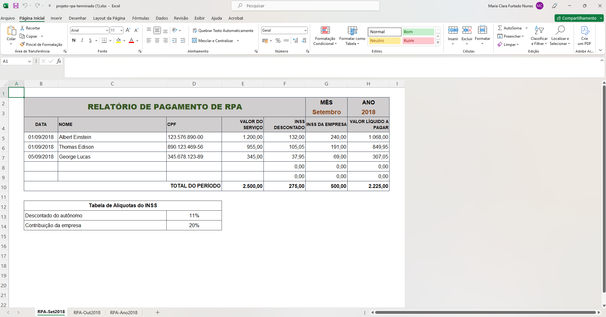
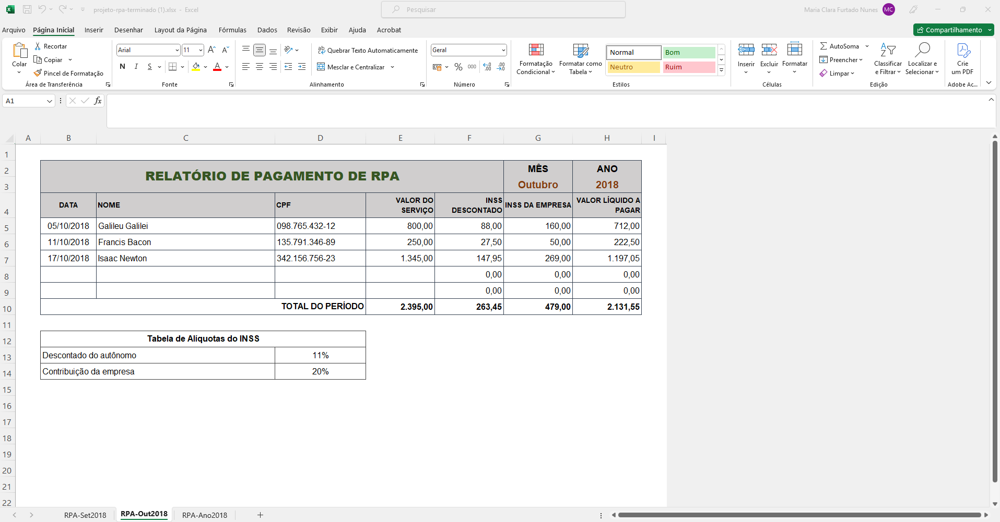
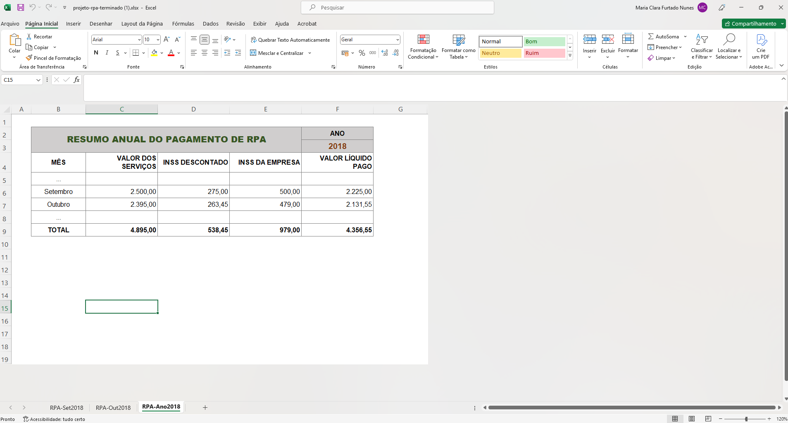

📊 Sistema de Controle e Relatório de Pagamentos de RPA

Este projeto consiste em uma planilha automatizada desenvolvida no Microsoft Excel para a gestão, cálculo e consolidação de Recibos de Pagamento de Autônomo (RPA). Ideal para setores de Recursos Humanos, Departamento Pessoal ou microempresas que buscam organizar o fluxo de pagamentos de prestadores de serviços autônomos.

📸 Demonstração do Projeto

Aqui está uma prévia visual de como a planilha está estruturada e organizada:

- Relatório de Pagamento de RPA de Setembro de 2018

- Relatório de Pagamento de RPA de Outubro de 2018

- Resumo Anual do Pagamento de RPA

🚀 Funcionalidades

- Cálculo Automatizado de Impostos: Aplicação dinâmica das alíquotas de INSS retido do autônomo (11%) e da contribuição patronal da empresa (20%).
- Relatórios Mensais Detalhados: Abas organizadas por períodos contendo informações como:
  - Data de pagamento
  - Nome do profissional e CPF
  - Valor bruto do serviço
  - Deduções (INSS)
  - Valor líquido final a pagar.
- Consolidação Anual Automatizada: Uma aba de resumo anual (`RPA-Ano2018`) que compila e soma os totais de serviços prestados, impostos gerados e valores líquidos pagos mês a mês.

📁 Estrutura do Arquivo

A planilha está dividida em 3 abas principais:
1. `RPA-Set2018`: Relatório e detalhamento dos pagamentos do mês de setembro.
2. `RPA-Out2018`: Relatório e detalhamento dos pagamentos do mês de outubro.
3. `RPA-Ano2018`: Painel consolidado com a soma anual de todas as movimentações financeiras das RPAs.

🛠️ Tecnologias e Recursos Utilizados

- Microsoft Excel
- Fórmulas de soma, multiplicação e referências dinâmicas entre planilhas (`SOMA`, referências estruturadas).
- Formatação condicional e organização de tabelas financeiras.

📂 Como Utilizar

1. Faça o download do arquivo `projeto-rpa-terminado (1).xlsx` presente neste repositório.
2. Abra no Microsoft Excel ou Google Planilhas.
3. Insira os novos dados de prestadores de serviço nas abas mensais; os totais e o resumo anual serão atualizados de acordo com as regras de fórmulas estabelecidas.

---
💡 Desenvolvido para fins de organização financeira e automação de processos de DP.
